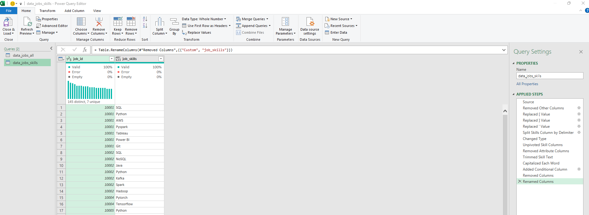

# Project 2 Analysis

## Introduction

As a former job seeker, I always found it odd that there's not enough data on the best jobs and skills in the data science market. So, I decided to dive in and figure out what skills top employers are looking for and how to earn more.

### Questions to Analyze

To understand the data science job market, I asked the following:

1. **Do more skills get you better pay?**
2. **What’s the salary for data jobs in different regions?**
3. **What are the top skills of data professionals?**
4. **What’s the pay for the top 10 skills?**

### Excel Skills Used

The following Excel skills were utilized for analysis:

- ** Pivot Tables**
- ** Pivot Charts**
- ** DAX (Data Analysis Expressions)**
- ** Power Query**
- ** Power Pivot**

### Data Jobs Dataset

The dataset is from 2023 and includes real-world data science job information from my Excel course. It covers:

It includes detailed information on:

- ** Job titles**
- ** Salaries**
- ** Locations**
- ** Skills**

##  1 Do more skills get you better pay?

###  Skill: Power Query (ETL)

####  Extract

- I first used Power Query to extract the original data (`data_salary_all.xlsx`) and create two queries:
    -  First one with all the data jobs information.
    -  The second listing the skills for each job ID.

####  Transform

- Then, I transformed each query by changing column types, removing unnecessary columns, cleaning text to eliminate specific words, and trimming excess whitespace.
    -  data_jobs_all

        

    -  data_job_skills

        

####  Load

- Finally, I loaded both transformed queries into the workbook, setting the foundation for my subsequent analysis.
    -  data_jobs_all

        

    -  data_job_skills

        

###  Analysis

#### Insights

-  There is a positive correlation between the number of skills requested in job postings and the median salary, particularly in roles like Senior Data Engineer and Data Scientist.
-  Roles that require fewer skills, like Business Analyst, tend to offer lower salaries, suggesting that more specialized skill sets command higher market value.

    

#### So What

- This suggests that acquiring multiple relevant skills can lead to higher-paying roles.

## 2️ What’s the salary for data jobs in different regions?

###  Skills: PivotTables & DAX

#### Pivot Table

-  I created a PivotTable using the Data Model I created with Power Pivot.
-  I moved the `job_title_short` to the rows area and `salary_year_avg` into the values area.
-  Then I added new measure to calculate the median salary for United States jobs.
    ```
    =CALCULATE(
        MEDIAN(data_jobs_all[salary_year_avg]),
        data_jobs_all[job_country] = "United States")
    ```

####  DAX

- To calculate the median year salary I used DAX.

    ```
    Median Salary := MEDIAN(data_jobs_all[salary_year_avg])
    ```

###  Analysis

####  Insights

-  Job roles like Senior Data Engineer and Data Scientist command higher median salaries both in the US and internationally, showcasing the global demand for high-level data expertise.
-  The salary disparity between US and Non-US roles is particularly notable in high-tech jobs, which might be influenced by the concentration of tech industries in the US.

    

#### ** So What**

- These insights can help in planning and negotiating salaries by aligning offers with market standards, considering geographical differences.
## 3️ What are the top skills of data professionals?

###  Skill: Power Pivot

####  Power Pivot

-  I created a data model by integrating the `data_jobs_all` and `data_jobs_skills` tables into one model.
-  Since I had already cleaned the data using Power Query; Power Pivot created a relationship between these two tables.

####  Data Model

- I created a relationship between my two tables using the `job_id` column.

    

####  Power Pivot Menu

- The Power Pivot menu was used to refine my data model and makes it easy to create measures.

    

### Analysis

#### Insights

-  SQL and Python dominate as top skills in data-related jobs, reflecting their foundational role in data processing and analysis.
-  Emerging technologies like AWS and Azure also show significant presence, underlining the industry's shift towards cloud services and big data technologies.

    

#### So What

- Knowing the prevalent skills helps professionals stay competitive and guides training programs to focus on impactful technologies.

## 4️ What’s the pay of the top 10 skills?

###  Skill: Advanced Charts (Pivot Chart)

####  PivotChart

- I created a combo PivotChart to plot median salary and skill likelihood (%) from my PivotTable.
    -  **Primary Axis:** Median Salary (as a Clustered Column)
    -  **Secondary Axis:** Skill Likelihood (as a Line with Markers)
- To customize the chart, I added a title axis title, removed the lines (skill likelihood), and changed the markers to diamonds.

###  Analysis

#### Insights

-  Higher median salaries are associated with skills like Python, Oracle, and SQL, suggesting their critical role in high-paying tech jobs.
-  Skills like PowerPoint and Word have the lowest median salaries and likelihood, indicating less specialization and demand in high-salary sectors.

    

### So What

- Investing time in high-value skills like Python and SQL can lead to better-paying roles.
- 
## Conclusion

As a data enthusiast and former job seeker, I used Excel to uncover valuable insights about the data science job market. This analysis revealed key correlations between multiple skills and higher salaries, especially for in-demand technologies like Python, SQL, and cloud services. I hope this guide helps data professionals understand the skills needed for higher-paying roles.
